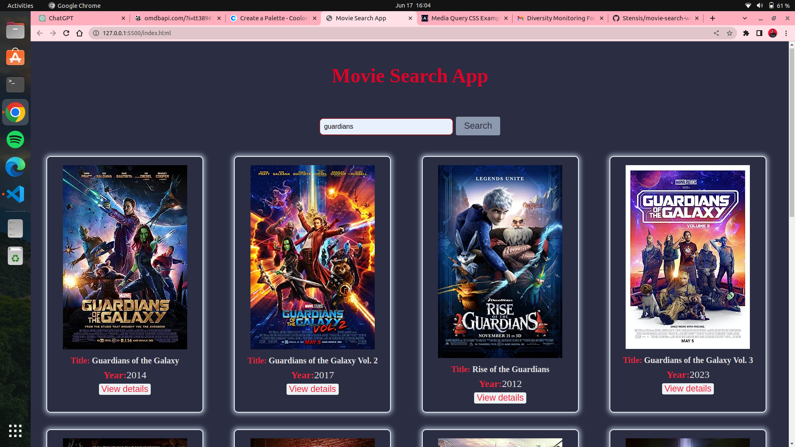
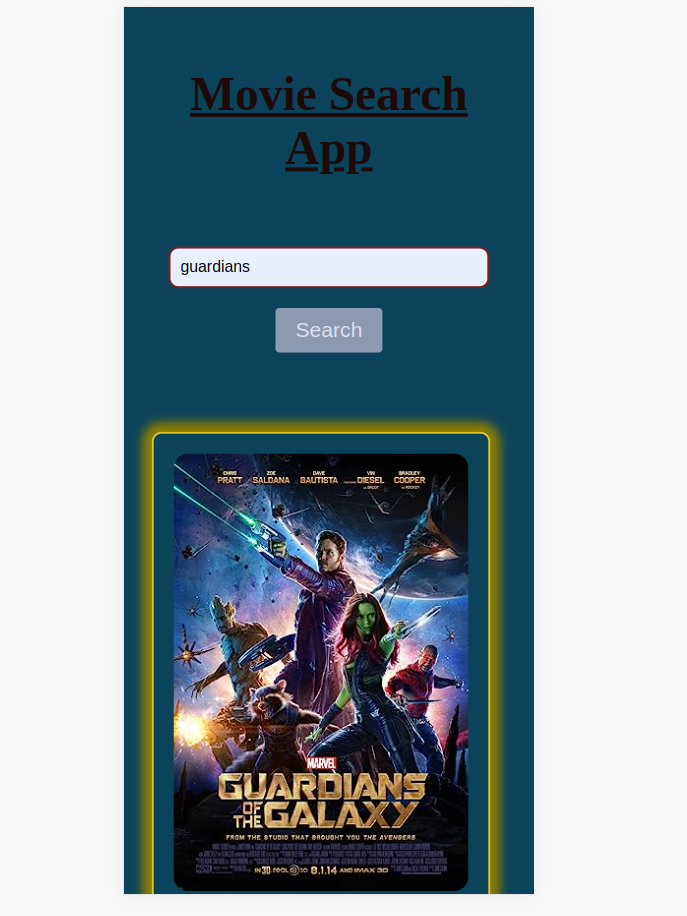

# Movie Search App

This is a Movie Search App that allows users to search for movies and retrieve relevant information about them. The app provides a user-friendly interface where users can enter movie titles and receive search results.

                                Larger screen

                                small devices 

                                Table of Contents

- [Features](#features)
- [Technologies Used](#technologies-used)
- [Getting Started](#getting-started)
- [Usage](#usage)
- [Contributing](#contributing)
- [License](#license)

## Features

- Search for movies using a keyword or title.
- Display a list of search results with relevant information for each movie.
- Click on a movie to view additional details.
- Responsive design for different screen sizes.

## Technologies Used

- HTML
- CSS
- JavaScript

## Getting Started

To get started with the Movie Search App, follow these steps:

1. Clone the repository: `git clone https://github.com/Stensis/movie-search-web.git`
2. Navigate to the project directory: `cd movie-search-app`
3. Open the `index.html` file in your preferred web browser.

## Usage

1. Enter a movie title or keyword in the search input field.
2. Click the "Search" button or press Enter to initiate the search.
3. The search results will be displayed below the search input.
4. Click on a movie to view additional details.
5. Explore the app and search for different movies as desired.

## Contributing

Contributions are welcome! If you find any issues or have suggestions for improvement, please feel free to submit a pull request or open an issue in the GitHub repository.

## License

This project is licensed under the [MIT License](LICENSE).

